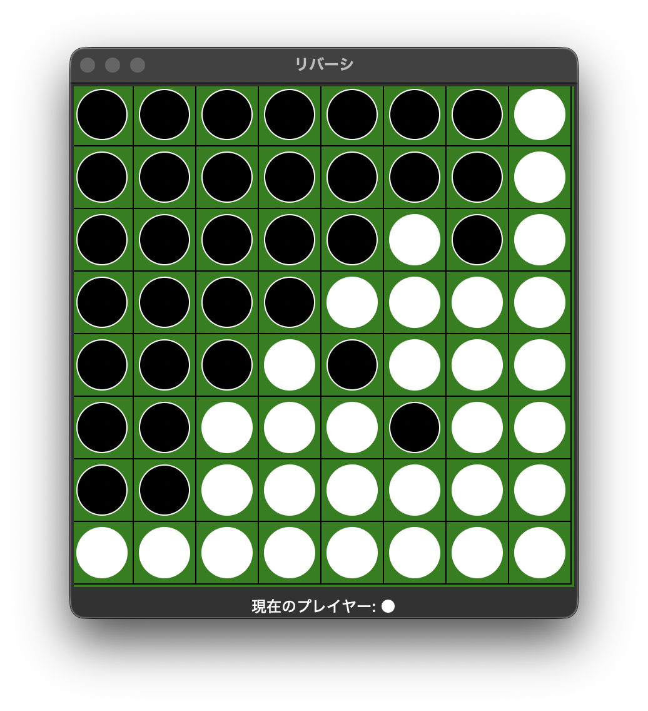

#  aic_reversi

リバーシ（オセロ）で AI アルゴリズムを実装して対戦できる教材リポジトリです。  
`cpu_algorithm` を書き換えるだけで、ローカル対戦・過去モデル対戦・オンライン対戦を試せます。


## 目次
- [クイックスタート](#クイックスタート)
- [対戦モード](#対戦モード)
- [アルゴリズム実装](#アルゴリズム実装)
- [モデルの切り替え](#モデルの切り替え)
- [ディレクトリ構成](#ディレクトリ構成)
- [過去の大会](#過去の大会)

## クイックスタート

### 1. `uv` のインストール
```sh
# macOS / Linux
curl -LsSf https://astral.sh/uv/install.sh | sh

# Windows (PowerShell)
powershell -ExecutionPolicy ByPass -c "irm https://astral.sh/uv/install.ps1 | iex"
```

### 2. リポジトリを取得
```sh
git clone https://github.com/KeioAIConsortium/aic_reversi.git
cd aic_reversi
uv sync
```

### 3. まずは人間対戦を起動
```sh
uv run vs_models.py
```

起動後に `questionary` の選択メニューが表示されます。上下の矢印キーで
`human` を選び、Enter キーで決定します。

`tkinter` 非対応の Python では GUI が表示されません。  
画面が出ない場合は、`tkinter` を含む Python 環境を利用してください。

## 対戦モード

| モード | スクリプト | 実行コマンド | 概要 |
| --- | --- | --- | --- |
| 人間 vs 自作CPU | `vs_human.py` | `uv run python vs_human.py` | まず動作確認する基本モード |
| 過去優勝モデル vs 自作CPU | `vs_bestmodel.py` | `uv run python vs_bestmodel.py` | 強い既存モデルと直接比較 |
| 選択した相手 vs 自作CPU | `vs_models.py` | `uv run vs_models.py` | 人間や各レベルのCPUなどからメニューで選択 |
| オンライン対戦 | `online_battle.py` | `uv run python online_battle.py` | ネットワーク経由で対戦 |

## アルゴリズム実装

各スクリプトの `cpu_algorithm(board, player_num)` を編集してください。  
最小構成は次のとおりです（`vs_human.py` などで同様に使えます）。

```python
def cpu_algorithm(board, player_num):
    valid_moves = []
    for x in range(1, 9):
        for y in range(1, 9):
            if ReversiGUI.validate_reversible(board, player_num, x, y):
                valid_moves.append([x, y])
    if valid_moves:
        return valid_moves[0]
    return valid_moves
```

## モデルの切り替え

### 過去モデルを切り替える（`vs_bestmodel.py`）
```python
from models.spring_2026.best_algorithm import cpu_algorithm as best_algorithm # 過去の優勝モデルを使用
```

### 対戦相手を選択する（`vs_models.py`）
```console
$ uv run vs_models.py
? 使用するモデルを選択してください (Use arrow keys)
 » human
   lv0
   lv1
   ...
```

上下の矢印キーで対戦相手を選び、Enter キーで決定してください。

| 選択肢 | 対戦相手 |
| --- | --- |
| `human` | 人間 |
| `lv0` | ランダムに手を選ぶCPU |
| `lv1` | ひっくり返せる石の数を優先するCPU |
| `lv2` | コーナーを優先するCPU |
| `lv3` | 位置の重み付けを使うCPU |
| `lv4` | 過去の授業で使われた強いCPU |
| `lv5` | αβ法を使うCPU |
| `student_best` | 過去大会の優勝モデル |
| `alphabeta` | αβ法のモデル |

### オンライン対戦の先後（`online_battle.py`）
```python
online_model(is_first=True, local_algorithm=cpu_algorithm)
```

`is_first=True` で先手、`False` で後手になります。

## ディレクトリ構成

```text
aic_reversi/
├── src/                  # GUI・オンライン処理
├── models/
│   ├── cpu/              # レベル別CPU
│   ├── spring_2025/      # 過去大会モデル
│   └── spring_2026/      # 過去大会モデル
├── vs_human.py
├── vs_bestmodel.py
├── vs_models.py
└── online_battle.py
```

## 過去の大会

| 開催 | 概要 | 結果 |
| --- | --- | --- |
| `🌸spring_2025` | 高校3年生向け Python 初級講座で CPU 実装対戦 | `team a` 優勝 |
| `🍧aicdays_2025` | 中高生向け講座（Python 初級 / GAS×Python 中上級） | 通信対戦実装まで実施 |
| `🌸spring_2026` | 高校3年生向け Python 初級講座で CPU 実装対戦 | `team 3校合同` が 2025 年モデル超え @Suzu-Yasu|
